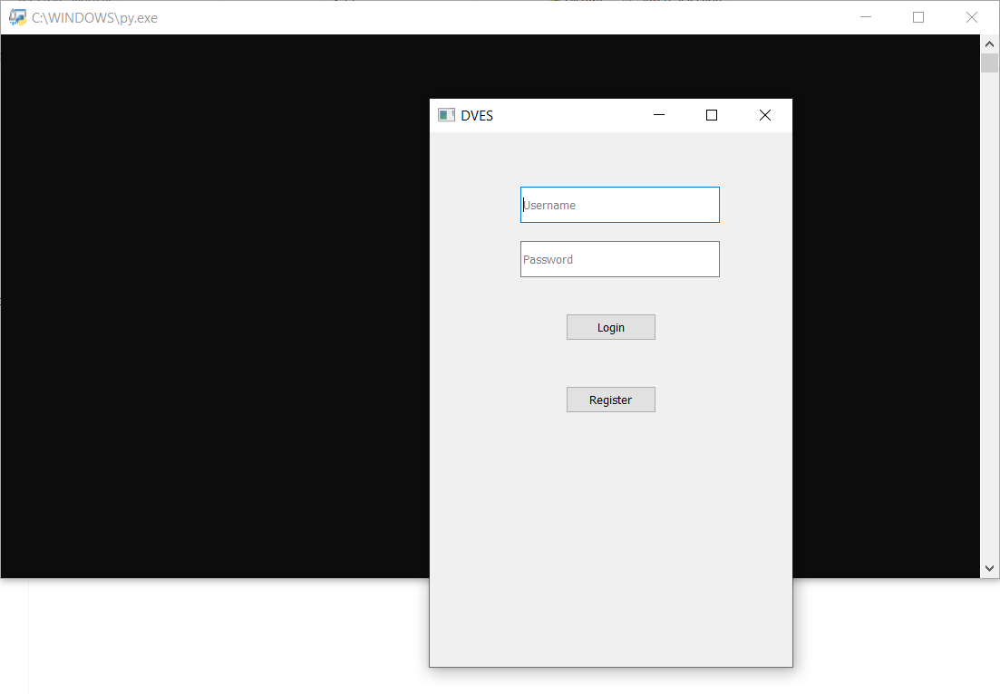
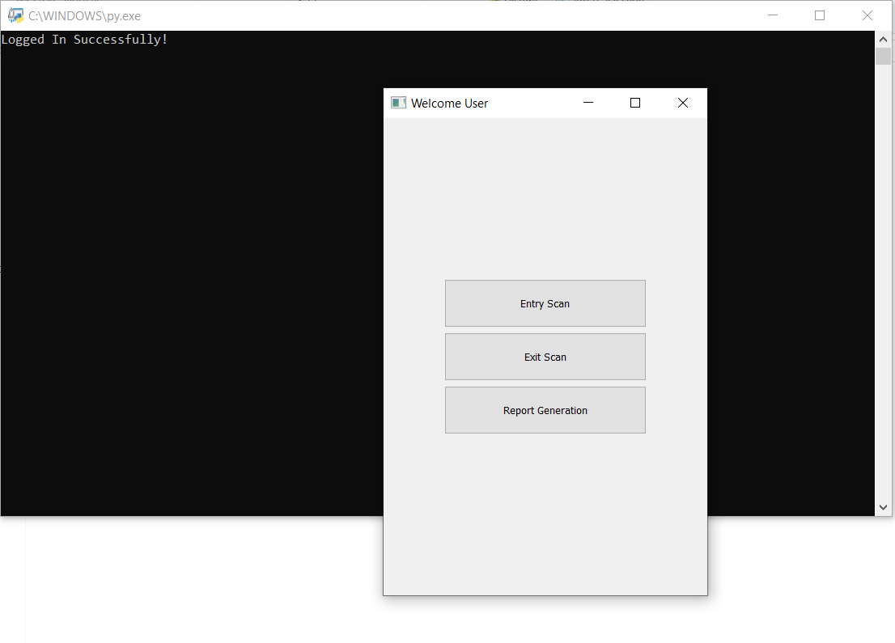
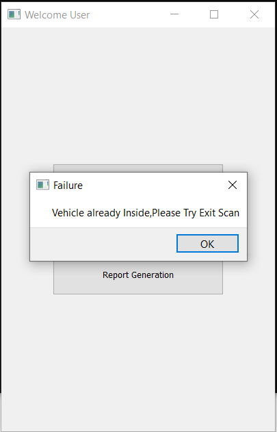
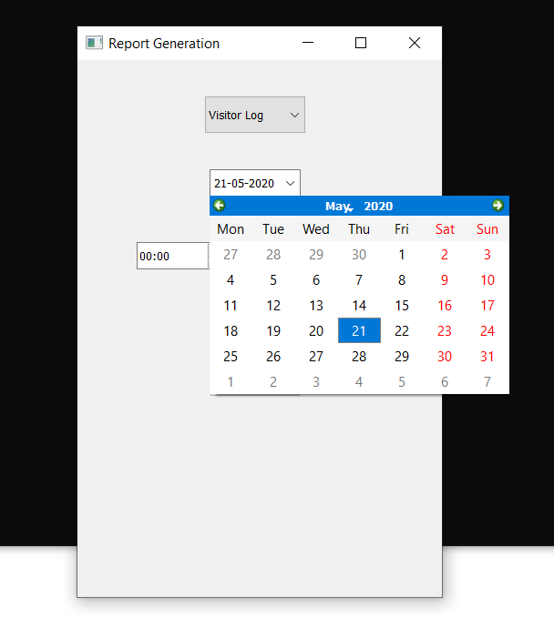
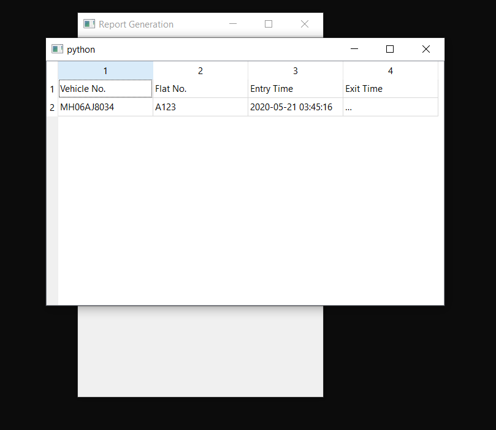

# AGES
Automatic Gate Entry System

Place image to scan in the same folder. Image should be named test.jpg.
Run ages_gui.py

# Basic Startup:

# Register:

# Login with your credentials to get to the main screen:

# To Scan Click on Entry/Exit Scan:

# What if Vehicle is already inside/outside when Entry/Exit Scan is clicked? :

# Generating Reports :
Select the log you want the report of

Pick the date

Pick the Start and End Time

# Successfully Generated Reports:
For Residents:

For Visitors:

